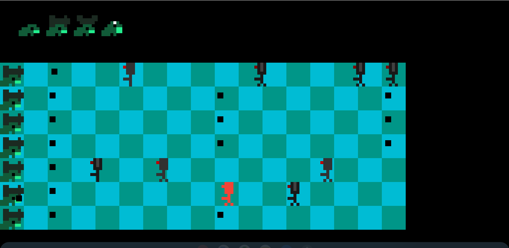

:frog: Frog Wars, Yes, frogs.

**Live Demo:** [thcheetah777.github.io/luckyalien/](https://thcheetah777.github.io/frogWars/)

## Description

#### **The only hope for the Earth is frogs. Yes, frogs.**

In the future, machines have gotten sentient life and are succeeding in taking over the world but the frog ancients were fighting back and with the last of their energy, they joined together and built a pond that would save the world. 

## Getting Started

### Cloning

* Open your preferred command line or terminal
* Copy and enter this into the prompt

```
git clone https://github.com/thcheetah777/frogWars/
```

* Wait for it to unpack
* After it's done cloning, enter

```
cd frogWars
```

### Running the game

You need to set up the server via Python. (If you don't have Python, download it [here](https://www.python.org/)) Do this by entering
```
python -m http.server
```
or
```
python3 -m http.server
```
or
```python -m SimpleHTTPServer``` and ```python3 -m SimpleHTTPSServer``` on Linux machines
After you activate the server, got to [localhost:8000](http://localhost:8000/) to play the game

## Contribution

Read [CONTRIBUTING.md](https://github.com/thcheetah777/frogWars/blob/master/CONTRIBUTING.md) for more info

## Version History

None yet. :disappointed:

## License

This project is licensed under the MIT License - see the [LICENSE](https://github.com/thcheetah777/frogWars/blob/master/LICENSE) file for full details

## Acknowledgments

* Inspiration: [Plants vs Zombies](https://en.wikipedia.org/wiki/Plants_vs._Zombies)
* Music: [Video Game Music (Kirby)](https://downloads.khinsider.com/game-soundtracks/album/kirby-the-very-best-of-kirby)
* Graphics: [My team on Pixilart.com](https://pixilart.com)
* Level Design: Me and my team
